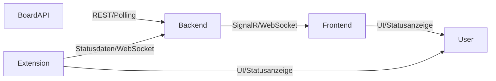

<!-- Implementation Status Update: 04. April 2026 -->

# Implementierungsstatus (Issues #10–#18)

| Issue | Titel | Backend | UI | Tests | Abweichungen |
|-------|-------|---------|-----|-------|-------------|
| #10 | Board Status Monitoring | ✅ | ✅ | ✅ | — |
| #11 | Tournament Plan UI | ✅ | ✅ BracketView, GroupTable, MatchCard (4 Varianten) | ✅ | Drag&Drop nur für Boards (nicht Teilnehmer in Bracket) |
| #12 | Scheduling Engine | ✅ | ✅ Spielplan-Tab | ✅ | SignalR-Echtzeit statt reinem Polling |
| #13 | Seeding/Walkover/Bye | ✅ Felder + Config + Lostopf | ✅ Seeding-UI | — | Lostopf-Verfahren vollständig implementiert (pot-basierte Gruppenauslosung) |
| #14 | Live Eventing | ✅ TournamentHub, Discord, Notifications, WebPush | ✅ Follow-Button, Discord-Config, Service Worker | ✅ | Browser Push mit VAPID vollständig (Service Worker + Backend) |
| #15 | Roles & Policies | ✅ TournamentRole Enum, ViewPreferences, TournamentAuthorizationService | ✅ IsCurrentUserManager + read-only Hinweise | ✅ Scope-Regressionen | Einzelne Read-Endpunkte weiterhin bewusst oeffentlich |
| #16 | Tiebreaker & Statistics | ✅ Erweiterte ScoringCriterionType, GroupStandingDto | ✅ GroupTable mit ext. Stats | ✅ | Automatische Tiebreaker-Berechnung noch nicht serverseitig |
| #17 | Interactive UI (SplitButton) | — | ✅ SplitButton-Komponente + Status/Board-Integration | ✅ UI-Regression (manuell) | — |
| #18 | Match Statistics | ✅ Entity, Services, Endpoints | ✅ MatchStatistics-Panel, Sync | ✅ | — |

## Bekannte Abweichungen von Spezifikation

1. **Rollen-Enforcement (#15):** Serverseitige Turnierpruefungen sind fuer kritische Mutationen aktiv, einige Read-Endpunkte bleiben oeffentlich. **→ Weitere Verfeinerung fuer feinere Read-Policies geplant.**
2. ~~**Browser Push (#14):** Backend-Infrastruktur (NotificationSubscription, Endpoints) vollständig. Frontend Service Worker für Push-API fehlt.~~ **→ Umgesetzt am 03.04.2026:** Service Worker, Push-Interop JS, VAPID-Konfiguration, WebPush-Library-Integration.
3. ~~**Lostopf-Verfahren (#13):** Nur einfaches Top-N Seeding implementiert.~~ **→ Umgesetzt am 03.04.2026:** Pot-basierte Gruppenauslosung mit SeedPot-Feld, automatischer Pot-Zuweisung und randomisierter Verteilung innerhalb der Töpfe.
4. ~~**Matchkomponente (#10/11):** MatchCard nur eine Variante.~~ **→ Umgesetzt am 03.04.2026:** 4 Varianten (compact, detailed, board, live) mit StatusBadge-RenderFragment und Live-Puls-Animation.
5. **Infowall/Streaming:** Nicht implementiert. **→ Geplant für kommende Releases.**
6. ~~**Echtzeit-Synchronisierung:** TournamentHub existiert, aber Clients subscriben noch nicht aktiv.~~ **→ Umgesetzt am 03.04.2026:** SignalR-Client (TournamentHubService) mit automatischer Reconnect-Logik, Event-Handlers, Hub-Group-Management. Timer als Fallback auf 30s erhöht.

## Statusupdate 04. April 2026 (Ergaenzungen)

### 1) Integrierte Onlinehilfe und Tooltips
- Umgesetzt: Markdown-basierter Help-Katalog (`docs/06-ui-help.md`) mit eindeutigen Keys.
- Umgesetzt: `UiHelpService` + `UiHelpIcon` in der Web-UI.
- Umgesetzt: Tooltip-Bindings in Kernseiten (Dashboard, Landing, Register, Matches, Boards, Settings, Profile, MyTournaments).

### 2) Anwenderdokumentation mit UI-Verknuepfung
- Umgesetzt: Einheitliche MD-Notation `### [help:key]` bzw. `### help:key`.
- Umgesetzt: Klare Zuordnung pro UI-Element ueber help-Key.

### 3) End-to-End-Pruefung Datenkonsistenz (tournamentId/boardId)
- Umgesetzt: Serverseitige Guard-Checks verhindern Cross-Tournament-Boardzuweisungen.
- Umgesetzt: Scheduling ignoriert Fixed-Board-Konfigurationen ausserhalb des Turnier-Scopes.
- Umgesetzt: UI-Boardlisten laden kontextbezogen nach aktivem Turnier.

### 4) Automatisierte Dokumentationspflege
- Umgesetzt: Verbindlicher Pflegeprozess in `docs/09-documentation-maintenance.md` dokumentiert.

### 5) Testabdeckung und Regressionstests
- Umgesetzt: Neue Regressionstests fuer Board/Tournament-Consistency in Infrastructure-Tests.
- Umgesetzt: Parser-Tests fuer den UI-Hilfekatalog in Web-Tests.

### 6) Erweiterung REST-API-Dokumentation
- Umgesetzt: Vollstaendige Endpoint-Uebersicht in `docs/07-rest-api.md` inkl. Beispiel-Requests und Fehlerfaellen.

### 7) UI/UX-Review und Barrierefreiheit
- Umgesetzt: Review-Dokument und Checkliste in `docs/08-ui-ux-accessibility-review.md`.
- Offen (naechste Iteration): Vertiefte Keyboard-/Screenreader-Feinabstimmung fuer komplexe Dialog- und DnD-Flows.

---

## 15. Rollen- und Policy-Logik (API, UI)

### Zielbild
Das System unterstützt ein differenziertes Rollen- und Berechtigungskonzept für alle Kernbereiche (Turnier, Teilnehmer, Verwaltung, API, UI). Policies steuern, welche Aktionen und Daten für welche Rolle sichtbar und bearbeitbar sind. Die Rechteprüfung erfolgt konsistent im Backend (API) und Frontend (UI).

### Rollenmodell
- **Spielleiter (Admin/Manager):** Vollzugriff auf alle Turnier- und Verwaltungsfunktionen, inkl. Teilnehmermanagement, Planung, Boardzuweisung, Ergebnisfreigabe, Einstellungen, Live-Eventing, Webhook-Konfiguration.
- **Teilnehmer:** Lesender Zugriff auf Turnierdaten, eigene Matches, Ergebnisse, Boardzuweisung, Benachrichtigungseinstellungen. Keine administrativen Rechte.
- **Zuschauer:** Lesender Zugriff auf öffentliche Turnierdaten, Matches, Ergebnisse, Infowall/Streaming. Keine persönlichen Einstellungen, keine Teilnahme.
- **System/Integration:** Technische Rolle für API-Clients, Webhooks, Extension, ggf. externe Systeme. Rechte nach Policy.

### Rechte/Policies pro Rolle
| Aktion/Funktion                | Spielleiter | Teilnehmer | Zuschauer | System/Integration |
|-------------------------------|:-----------:|:----------:|:---------:|:-----------------:|
| Turnier erstellen/löschen     |      X      |            |           |                   |
| Teilnehmer verwalten          |      X      |            |           |                   |
| Teams verwalten               |      X      |            |           |                   |
| Setzliste/Lostöpfe bearbeiten |      X      |            |           |                   |
| Gruppenauslosung              |      X      |            |           |                   |
| Spielplan bearbeiten          |      X      |            |           |                   |
| Boardzuweisung                |      X      |            |           |                   |
| Match starten/beenden         |      X      |            |           |                   |
| Ergebnisse freigeben          |      X      |            |           |                   |
| Webhook konfigurieren         |      X      |            |           |                   |
| Live-Eventing                 |      X      |     X      |     X     |         X         |
| Eigene Matches sehen          |      X      |     X      |           |                   |
| Alle Matches sehen            |      X      |     X      |     X     |         X         |
| Benachrichtigungen verwalten  |      X      |     X      |           |                   |
| Infowall/Streaming            |      X      |     X      |     X     |         X         |
| API-Zugriff                   |      X      |     X      |     X     |         X         |

### UI/UX-Anforderungen
- Im Adminbereich: Alle Verwaltungsfunktionen nur für Spielleiter sichtbar und bedienbar.
- Teilnehmer sehen nur eigene Matches, Ergebnisse, Boards, Benachrichtigungen.
- Zuschauer sehen nur öffentliche Turnierdaten, keine persönlichen Einstellungen.
- Rollenabhängige Navigation und Sichtbarkeit von Buttons/Aktionen.
- Fehler- und Hinweistexte bei fehlenden Berechtigungen.
- Rollenwechsel (z.B. Teilnehmer → Spielleiter) nur durch autorisierte Nutzer/Admins.

- Teilnehmer & Zuschauer sehen im UI keinerlei Elemente, für die sie nicht berechtigt sind. Alle administrativen Funktionen und Bearbeitungsoptionen sind ausschließlich Turnierleitern vorbehalten.
- Teilnehmer haben Zugang zum Spielplan, dürfen dort aber nicht eingreifen (read-only). Zuschauer sehen nur öffentliche Turnierdaten.
- Solange das Turnier nicht gestartet wurde und die Registrierung offen ist, können sich registrierte Teilnehmer noch austragen. Die Teilnehmerliste ist einsehbar (nur Namen/Teams), ansonsten ist nur der Spielplan sichtbar.
- DartSuite arbeitet immer pro Turnier: Teilnehmer & Turnierleiter sehen nur die Turniere, bei denen sie teilnehmen oder als Veranstalter agieren, und sind nur für diese berechtigt.
- Es gibt keine Möglichkeit, auf fremde Turniere zuzugreifen. Dies beeinflusst die Menüstruktur und Navigation.
- Abgesehen von Login und Benutzereinstellungen sind alle anderen Pages einem Turnier untergeordnet.

#### Menüstruktur (Beispiel)
* Login
* Dashboard
* Registrieren
* Meine Turniere
  * Übersicht
  * Laufende
* Einstellungen
  * Allgemein
  * Benutzer

Wenn ein Turnier geöffnet wurde (aus Menü, Dashboard oder Schnellauswahl), erhält das Turnier einen eigenen Menüeintrag mit Turniernamen. Alle Tabs der Tournamentpage werden als Submenüeinträge angezeigt, um schnelle Navigation zu ermöglichen.

### Validierung & technische Umsetzung
- Rechteprüfung erfolgt serverseitig (API) und clientseitig (UI) konsistent.
- Policies werden zentral definiert und versioniert.
- Jeder API-Endpunkt prüft die Rolle und verweigert unberechtigte Aktionen.
- UI blendet nicht erlaubte Aktionen/Buttons aus und zeigt Hinweise bei fehlender Berechtigung.
- Rollen werden bei Registrierung, Einladung oder durch Admin zugewiesen.
- System-/Integrationsrolle erhält nur explizit freigegebene Endpunkte.

### Beispiele/Testfälle
- Ein Teilnehmer versucht, die Setzliste zu bearbeiten → Aktion wird verweigert, Hinweis angezeigt.
- Ein Zuschauer ruft die Infowall auf → sieht alle Matches, aber keine persönlichen Einstellungen.
- Ein Spielleiter konfiguriert einen Discord Webhook → nur im Adminbereich möglich.
- Ein API-Client (Integration) ruft Live-Events ab → Zugriff nur auf freigegebene Events.

### Akzeptanzkriterien
- Alle Rollen und Policies sind zentral dokumentiert und technisch enforced.
- Keine Rolle kann unberechtigte Aktionen durchführen (API & UI).
- Die UI zeigt nur zulässige Aktionen und blendet alles andere aus.
- Fehler- und Hinweistexte sind verständlich und rollenabhängig.
- Rollenwechsel und Rechtevergabe sind nachvollziehbar und auditierbar.

## 14. Live-Eventing, Discord Webhook & Benachrichtigungen

### Zielbild

Alle relevanten Status- und Matchereignisse (z.B. Matchstart, Leg-Ende, Boardwechsel, Statuswechsel, neue Ergebnisse) werden in Echtzeit an alle verbundenen Clients (UI, Extension, externe Systeme) übertragen. Die Kommunikation erfolgt primär über SignalR/WebSockets, Fallback per Polling. Zusätzlich werden Turnierevents (insbesondere Matchende) automatisiert an einen konfigurierbaren Discord Webhook gesendet. Push-Notifications (Browser) werden für abonnierte Matches bereitgestellt.

### Fachliche Anforderungen
- Live-Übertragung von Spielständen, Board-Status, Matchstatus, Zeitplanänderungen und Events
- Sofortige Aktualisierung der UI bei Status- oder Ergebnisänderungen
- Unterstützung für mehrere gleichzeitige Clients (z.B. Spielleiter, Zuschauer, Infowall)
- Ereignisse: Match erstellt, Match gestartet, Leg/Set beendet, Match beendet, Boardstatus geändert, Teilnehmerstatus geändert, Zeitplanänderung, Walkover/Freilos
- Erweiterbar für zukünftige Eventtypen (z.B. Chat, Notifications)

- Am Turnier kann ein Discord Webhook konfiguriert werden (URL, Channel, optionaler Text).
- Beim Beenden eines Matches wird das Ergebnis als Card mit den wichtigsten Matchdetails (Teilnehmer, Ergebnis, ggf. Highlights) im zugehörigen Discord-Channel gepostet.
- Teilnehmer können Push-Notifications (Browser) abonnieren für:
  - Eigene Matches
  - Manuell gefolgte Matches (in den Matchdetails)
  - Alle Matches
- Die Benachrichtigungseinstellungen sind Teil der Benutzer-Einstellungen (Landingpage) und der Registrierung.
- Die Echtzeit-Synchronisierung der Matches (Spielstände, Livevorschau im Turnierbaum, Blitztabelle in Gruppenphase) ist ein Core Feature und muss mit sehr kurzen Intervallen (Polling) oder idealerweise eventgesteuert (Just-in-time) erfolgen.

### Technische Anforderungen
- Backend: SignalR-Hub für alle relevanten Eventtypen
- Eventmodell mit EventType, Payload, Timestamp, MatchId/BoardId/ParticipantId
- Authentifizierung und Autorisierung für Eventempfang (z.B. Spielleiter vs. Zuschauer)
- Skalierbarkeit für viele parallele Clients (z.B. Infowall, Streaming)
- Fallback-Mechanismus: Polling bei fehlender WebSocket-Unterstützung
- Erweiterbar für externe Integrationen (z.B. REST-Webhook, MQTT)

- Discord Webhook: Konfigurierbare URL pro Turnier, POST von Match-Events (insb. Matchende) als Card-Format (Discord Embed) mit allen relevanten Matchdetails.
- Push-Notifications: Browser Push via Service Worker, Subscription-Management pro Benutzer, Eventauslösung bei relevanten Match-Events.
- Abos: Speicherung der Benachrichtigungspräferenzen pro Benutzer (eigene Matches, gefolgte Matches, alle Matches).
- Settings: Integration der Benachrichtigungseinstellungen in Benutzerprofil und Registrierung (Landingpage).

### UI/UX-Anforderungen
- UI-Komponenten (Turnierplan, Spielplan, Boarddetails, Matchansicht) reagieren in Echtzeit auf Events
- Visuelle Hervorhebung bei neuen Events (z.B. Animation, Badge, Sound optional)
- Fehleranzeige bei Verbindungsabbruch oder Event-Backlog
- Optionale Event-Historie/Log für Spielleiter

- Im Turnier-Adminbereich: Möglichkeit zur Konfiguration des Discord Webhooks (URL, Channel, Testfunktion).
- In den Matchdetails: Button „Match folgen“ für manuelles Abo.
- In den Benutzereinstellungen/Landingpage: Auswahl der Benachrichtigungspräferenzen (eigene, gefolgte, alle Matches).
- Bei neuen Push-Notifications: Anzeige als Browser-Benachrichtigung mit Matchdetails und Link zum Match.

### Beispiele/Testfälle
- Spielleiter startet ein Match → alle verbundenen UIs zeigen sofort den neuen Status an
- Ein Boardstatus wechselt auf „Error“ → UI und Extension erhalten sofort ein Event und zeigen Warnung
- Ein Zuschauer öffnet die Infowall → erhält alle aktuellen Spielstände und Status in Echtzeit
- Ein Walkover wird gesetzt → Fortschritt im Turnierbaum wird sofort aktualisiert

- Ein Turnierleiter konfiguriert einen Discord Webhook. Nach Matchende wird automatisch eine Discord Card mit Ergebnis und Highlights im Channel gepostet.
- Ein Teilnehmer abonniert „eigene Matches“ und erhält eine Browser-Push-Notification, sobald sein nächstes Match startet.
- Ein Benutzer folgt einem bestimmten Match in den Matchdetails und erhält bei jedem Statuswechsel eine Benachrichtigung.
- In der Gruppenphase wird die Blitztabelle in der UI in Echtzeit aktualisiert, sobald ein Leg beendet ist.

### Akzeptanzkriterien
- Alle relevanten Events werden in Echtzeit an alle verbundenen Clients übertragen
- UI-Komponenten reagieren ohne Reload auf Status- und Ergebnisänderungen
- Verbindungsabbrüche werden erkannt und angezeigt
- Eventmodell ist erweiterbar und dokumentiert
- Fallback-Mechanismus funktioniert zuverlässig

- Discord Webhook ist pro Turnier konfigurierbar und postet relevante Match-Events automatisiert als Card in den Channel.
- Push-Notifications funktionieren für alle abonnierten Matches und sind in Benutzerprofil und Registrierung steuerbar.
- Abos und Benachrichtigungseinstellungen werden korrekt gespeichert und angewendet.
- Echtzeit-Synchronisierung der Spielstände und Tabellen ist performant und zuverlässig.
# requirements.ai (Zentrale Requirements- und Statusdatei)

_Letzte Aktualisierung: 30. März 2026_

## Ziel und Zweck
Diese Datei ist die zentrale Arbeits- und Spezifikationsdatei für alle Anforderungen, Ideen, Umsetzungsstände, Schwachstellen und offenen Punkte der DartSuite. Sie ersetzt alle bisherigen Einzelübersichten und wird fortlaufend gepflegt.

---

## Inhaltsverzeichnis
1. Architektur & Systemüberblick
2. Funktionsmatrix & Status
3. Offene Anforderungen & Widersprüche
4. Schwachstellen & Risiken
5. Empfehlungen & nächste Schritte
6. Historie & Quellen

---

## 1. Architektur & Systemüberblick

**Schichtenmodell (Clean/DDD-inspiriert):**
- Domain: Businessobjekte (Tournament, Participant, Team, Board), Enums
- Application: Use Cases, Validierungen, Statusmanagement, Services
- Infrastructure: DB, Integrationen (Board-API, Storage, externe Dienste)
- API: REST-Endpunkte (ASP.NET Core)
- Web: Blazor-Frontend (aktuell: Boards-Komponente produktiv, weitere Module in Entwicklung)

**Architektureinschätzung:**
- Klare Trennung, moderne .NET-Architektur, gute Erweiterbarkeit

---

## 2. Funktionsmatrix & Status

| Featurebereich                | Soll (laut .ai)         | Ist (Code)                | Status/Bemerkung                                  |
|------------------------------|-------------------------|---------------------------|---------------------------------------------------|
| Turnier-Lifecycle            | Vollständig, Statuslogik| Enum & Felder, Logik rud. | Statuswechsel teils manuell, Reset teils offen    |
| Teilnehmer/Teams             | Add/Remove, Seed, Group | Grundlegend vorhanden     | Setzlisten/Seeds nur angedeutet                   |
| Gruppen-/KO-Planung          | Algorithmen, Drag&Drop  | Felder, Alg. angedeutet   | Bracket-/Gruppenberechnung fehlt/teilweise        |
| Boardmanagement              | Status, Zuordnung, Ext. | UI + Backend, Zuordnung   | Extension-Status, Match-Zuordnung fehlt           |
| Validierung                  | Komplex, Policies       | Basis, wenig Services     | Locked, Duplikate, Seed-/Gruppenkonflikt fehlt    |
| Rollen/Berechtigung          | Policies, Manager-Flag  | Model: Manager-Flag       | Rechteprüfung in API/Services fehlt               |
| Realtime/Live                | SignalR/WebSockets      | vorbereitet, nicht aktiv  | Eventing/Live fehlt, nur Felder                   |
| API-Client                   | Prognose, WS, Auth      | Grundstruktur, rudimentär | Prognose/WS/Retry/Validierung fehlt               |
| Browser-Extension            | Vollständige Steuerung  | Grundstruktur, UI         | Viele Features offen, Statusanzeige rudimentär     |
| Streaming/Infowall           | Banner, Infobox, Tabs   | Nicht vorhanden           | Nur geplant, keine Umsetzung                      |
| Testabdeckung                | Vollständig             | Teilweise                 | Coverage gering, v.a. Backend                     |

---

## 3. Offene Anforderungen & Widersprüche

### Noch nicht oder abweichend umgesetzt:
- Komplexe Prognosemodelle (API-Client)
- Vollständige Board-Statusüberwachung (inkl. Extension)
- Turnierplan-UI für Auslosung, Paarungen und Matchübersicht
- Spielplan-Engine für zeitliche Planung und dynamische Boardzuteilung
- Setzlisten-Logik, Walkover-Handling, Freilos-Logik
- Live-Eventing (SignalR/WebSockets)
- Rollen-/Policy-Logik (API, UI)
- Streaming-Ansicht, Infobox, Banner
- Validierungs- und Fehlerbehandlungslogik (Services)
- Erweiterte Gruppen-/KO-Algorithmen
- Automatisierte Testabdeckung, Regressionstests

### Widersprüche/Unklarheiten:
- Unterschiedliche Begriffsverwendung (Teilnehmer/Spieler, Team/Einzel)
- Redundante/abweichende Detailtiefe in .ai-Dateien
- Zentrale Arbeitsdatei fehlte bisher (jetzt requirements.ai)

---

## 4. Schwachstellen & Risiken
- Viele Features nur als Felder/Enums vorbereitet, Logik fehlt
- Eventing/Live-Mechanismen nicht implementiert
- Validierung und Fehlerbehandlung zu oberflächlich
- Testabdeckung gering, v.a. im Backend
- Policy-/Rollenlogik nicht enforced
- UI-Komponenten (außer Boards) nur rudimentär
- Browser-Extension weit hinter Spezifikation

---

## 5. Empfehlungen & nächste Schritte
- Komplexe Validierungs- und Statuslogik als Services komplettieren
- Rollenpolicies für API und UI bauen
- Bracket-/Gruppenlogik, Boardmapping zu Matches mit Algorithmen und Service-Implementierung ausformen
- UI/Frontend für Turnier, Registrierung, Matchprozesse systematisch erschließen
- Live/Realtime-Layer aufsetzen (SignalR, WebSockets, PubSub/Event-Bus)
- Testabdeckung und Fehlerbehandlung in allen Layern ausbauen
- Zentrale Pflege dieser Datei (requirements.ai) als Single Source of Truth

---

## 6. Historie & Quellen
- Ursprüngliche .ai-Markdown-Dateien: apiclient.md, browserextension.md, dartsuite.md, tournamentmanager.md
- Analyse- und Statusberichte: gh_copiilot_summary.md, chatgpt_summary.md (siehe unten)
- Codebasis: src/, extension/, tests/
- Stand: develop-Branch, 30. März 2026

---

## 7. Ablauf- und Detail-Spezifikation TournamentManager (aus chatgpt_summary.md)

### 1. Einleitung
Der ddpc.tournamentManager ist das zentrale System zur Planung, Verwaltung und Durchführung von Dartturnieren innerhalb der DartSuite. Ziel ist eine vollständig deterministische Abbildung aller Abläufe.

### 2. Grundarchitektur
Das System verbindet:
- DartSuite App
- Board API
- Chrome Extension
Alle Daten werden in Echtzeit über WebSockets synchronisiert.

### 3. Turnier Lifecycle
Status:
- erstellt
- geplant
- gestartet
- beendet
- abgebrochen
Logik:
- erstellt → geplant: Turnierplan vorhanden
- geplant → gestartet: erstes Match aktiv
- gestartet → beendet: Finale beendet
Rücksetzung:
- gestartet → geplant: Matches reset
- geplant → erstellt: komplette Planung gelöscht

### 4. Turniererstellung
- Name + Datum setzen
- TournamentId wird generiert
- Öffentlicher Link: ?tournamentId={guid}

### 5. Registrierung
Login:
- Autodarts Account
- Fallback: Spielername
Verhalten:
- Selbstregistrierung bei offenen Turnieren
- Anzeige eigener Matches

### 6. Rollen
Spielleiter:
- Vollzugriff
- Verwaltung aller Einstellungen
Teilnehmer:
- Nur lesender Zugriff

### 7. Teilnehmer & Teams
- Autodarts oder lokale Spieler
- Teamplay optional
- Jeder Spieler nur in einem Team

### 8. Turniermodi
- KO-Modus
- Gruppenphase + KO
- Online vs OnSite

### 9. KO Logik
- Auffüllen auf Zweierpotenz
- Freilose erzeugen Walkover
- Kein Freilos vs Freilos

### 10. Gruppenphase
- Gruppenanzahl
- Aufsteiger
- Spielmodi

### 11. Turnierplan
- Definiert Paarungen
- Drag & Drop Bearbeitung

### 12. Spielplan
- Zeit + Board Planung
- Dynamische Berechnung

### 13. Matches
Status:
- erstellt
- geplant
- warten
- aktiv
- beendet
- walkover

### 14. Echtzeit
- WebSockets bevorzugt
- Fallback Polling

### 15. Ablauf
- Turnier erstellen
- Teilnehmer
- Teams
- Modus
- Turnierplan
- Spielplan
- Matches

### 16. Validierung
- Mind. 1 Spielleiter
- Keine doppelten Spieler
- Kein Freilos-Duell

### 17. Einstellungen (Auszug)
Registrierung:
- Zeitgesteuert möglich
Teamplay:
- Zufällig oder manuell
Setzliste:
- beeinflusst Paarungen
Spielmodus:
- Dauer + Pausen relevant für Planung
Board:
- Fix oder dynamisch

### 18. State Machines
Turnier:
- erstellt → geplant → gestartet → beendet
Match:
- erstellt → geplant → warten → aktiv → beendet
- Walkover überspringt aktive Zustände

### 19. Scheduling Engine
Prinzip:
- nächstes spielbares Match wählen
- Spieler + Board prüfen
- Startzeit berechnen
Formel:
- Start = max(Spieler1, Spieler2, Board verfügbar)
Regeln:
- fixe Boards haben Vorrang
- Mindestpause beachten
- Verzögerungen berücksichtigen
Neu generieren:
- nur zukünftige Matches betroffen

### 20. Abschluss
Dieses Dokument ist eine deterministische Spezifikation für die Implementierung.

---

## 8. Board-Statusüberwachung, Visualisierung und Kommunikationswege (Backend, UI, Extension)

**Spezifikation:**

Die Board-Statusüberwachung und -Visualisierung muss folgende Anforderungen und Statusarten abdecken:

### Statusarten & Quellen

- **BoardStatus** (aus Autodarts Boardmanager API):  
  - Starting, Running, Stopped, Calibrating, Error  
  - Abrufbar über lokale Board-API (z.B. http://192.168.x.x/api/state)
- **ConnectionState** (Flagged Enum):  
  - Online (mit Autodarts.io verbunden)  
  - Offline (Autodarts.io nicht erreichbar)  
  - Lokal abrufbar über Board-API
- **Extension-Status (Browser Extension):**  
  - Connected (Extension sendet regelmäßig Statusdaten ans Backend, min. alle 10s)  
  - Offline (seit >30s keine Statusdaten)
  - Listening (WebSocket für Matchdaten aktiv)
- **MatchState:**  
  - None, Scheduled, Waiting, Started, Ended  
  - Gesteuert durch MatchEvents (Lobby erstellen, Match starten, Matchshot)
- **SchedulingStatus:**  
  - InTime (grün), Voraus (gelb), Verspätung (rot)  
  - Prognose für Spieldauer, Matchende, Startzeitpunkt des Folgematches, Toleranzgrenze (Start + ½ Matchdauer)

### Overall Status (Ampelfarben)

- **OK:** BoardStatus = Running, Verbindung Online & Connected (wenn kein Match), zusätzlich Listening bei aktivem Match
- **Warning:** SchedStatus = Voraus oder BoardStatus = Starting/Calibrating oder MatchStatus = Waiting
- **SchedError:** Jede andere Kombination

### Kommunikationswege

- **Backend ↔ Board:**  
  - Polling der lokalen Board-API (REST, z.B. /api/state)
  - Heartbeat/Ping-Mechanismus
- **Backend ↔ Extension:**  
  - Extension sendet Statusdaten regelmäßig (min. alle 10s)
  - WebSocket für Matchdaten (Listening)
- **Backend ↔ Frontend (UI):**  
  - WebSocket/SignalR für Echtzeit-Status
  - REST-API für initiale Daten
- **Frontend ↔ Extension:**  
  - Statusanzeige, Fehler, Matchdaten

### UI-Verhalten

- Überall, wo der Boardname angezeigt wird (außer Stammdaten/Boards-Page):
  - Klick auf Namen: Link zu Boarddetails (Modal/Popup)
  - Status-Icon (Success/Warning/Danger) für Overall Status
  - Hover über Status-Icon: Tooltip mit allen Einzelstatus (BoardStatus, ConnectionState, SchedStatus, MatchState, OverallState)
- **Boarddetails:**  
  - Boardname mit allen Statusinformationen
  - Planungsdetails: Verspätung, verfrühter Matchstart, voraussichtliches Spielende
  - Aktives Match als 2-zeilige Inlinekomponente
  - Spielplankomponente (gefiltert, abgeschlossene Matches ausblendbar, 5 Matches sichtbar, scrollbar, nächstes Match oben)
- **Turnier Dashboard:**  
  - Boards mit Status != OK werden prominent angezeigt
- **Navigation:**  
  - Im DartSuite-NavMenü unter „Boards“ für jedes Board ein Subentry mit Boardnamen und Status-Farbpunkt (Echtzeit-Status)
  - Boarddetails als eigene Razor-Seite (nicht Popup)

### Dokumentation & Visualisierung

- Alle Kommunikationsstrecken (Backend, Frontend, Extension) sind zu dokumentieren.
- Ein Mermaid-Diagramm soll die Architektur und Datenflüsse visualisieren.

### Beispiele/Testfälle

- Board verliert Verbindung → Status-Icon wird rot, Tooltip zeigt Details
- Extension sendet >30s keine Daten → Status auf Offline
- Match startet → Boardstatus auf Running, Listening aktiv
- SchedStatus wechselt auf Verspätung → Status-Icon gelb/rot, Planungsdetails aktualisiert
- Navigation zeigt für jedes Board den aktuellen Status als Farbpunkt

---

**Akzeptanzkriterien/Testfälle:**

- Alle Statusarten werden korrekt erkannt und angezeigt
- Statuswechsel werden in Echtzeit an UI und Extension übertragen
- Tooltips und Detailseiten zeigen alle Einzelstatus
- Kommunikationswege sind dokumentiert und als Mermaid-Diagramm visualisiert
- Fehlerfälle (Verbindungsabbruch, keine Extension-Daten, Board-API nicht erreichbar) werden robust behandelt und visualisiert

---

**Mermaid-Diagramm (Beispiel):**



---

## 9. Turnierplan und Spielplan fachlich trennen

### Zielbild

Der Turnierplan und der Spielplan sind als zwei getrennte fachliche Komponenten zu behandeln.

- **Turnierplan** beschreibt die Struktur des Turniers.
- **Spielplan** beschreibt die operative Durchführung des Turniers.

Die dynamische Boardzuteilung ist **kein Bestandteil des Turnierplans**, sondern Teil des Spielplans bzw. der Scheduling-Engine.

### Fachliche Verantwortung des Turnierplans

Der Turnierplan ist zuständig für:

- Auslosung und Teilnehmerverteilung
- Paarungen und Bracket-Struktur
- Gruppenstruktur und Gruppenspiele
- Fortschreibung von Gewinnern und Aufsteigern
- Darstellung von Matchstatus und Ergebnissen
- Übersicht über Herkunft und Nachfolger von Matches
- manuelle Korrekturen im fachlich zulässigen Rahmen

Der Turnierplan ist **nicht** zuständig für:

- exakte Startzeiten
- Boardvergabe im Livebetrieb
- Verzögerungsberechnung
- Matchdauer-Prognosen
- operative Umplanung auf Basis aktueller Boardverfügbarkeit

### Fachliche Verantwortung des Spielplans

Der Spielplan ist zuständig für:

- Startzeiten von Matches
- Boardzuweisung und Boardwechsel
- dynamische Boardzuteilung
- Verzögerungsberechnung
- Matchdauer-Prognosen
- Mindestpausen und Pufferzeiten
- Re-Scheduling zukünftiger Matches

Der Spielplan verwendet die Matchstruktur des Turnierplans als Eingabe, verändert aber nicht selbständig die Turnierstruktur.

### UI-Konzept Turnierplan

Der Turnierplan ist als fachliche Strukturansicht umzusetzen, nicht als operative Scheduling-Ansicht.

Die Anzeige einzelner Matches erfolgt über eine gemeinsame, wiederverwendbare Match-Razor-Komponente. Diese Komponente wird parametergesteuert in Turnierplan, Gruppenphase, K.O.-Phase, Spielplan und weiteren Matchlisten verwendet und zeigt je nach Kontext mehr oder weniger Details an.

#### Bereich Auslosung

Dieser Bereich dient der Vorbereitung des Turniers vor dem Start.

- Teilnehmerreihenfolge anzeigen
- Shuffle-Funktion
- Setzliste verwalten
- Gruppenzahl festlegen
- Gruppenauslosung durchführen
- Lostopf-Verfahren unterstützen
- Teamgenerierung und Teamzuweisung unterstützen

#### Bereich Turnierplan

Dieser Bereich visualisiert die Struktur des Turniers.

Für KO-Turniere:

- Bracket-Ansicht je Runde
- Matchkarten pro Paarung
- sichtbare Herkunft eines Teilnehmer-Slots, z. B. direkter Teilnehmer, Sieger aus Match X, Freilos
- sichtbarer Folgepfad des Match-Ergebnisses

Für Gruppenphasen:

- Gruppenraster
- Gruppentabelle
- Matchliste je Gruppe
- Sichtbarkeit der Aufsteigerlogik

Für beide Varianten:

- Statusanzeige je Match
- Ergebnisanzeige je Match
- Detailansicht pro Match
- klare Trennung zwischen Strukturinformation und Scheduling-Information

### Matchkarten im Turnierplan

Eine Matchkarte im Turnierplan zeigt nur fachlich relevante Informationen.

- Matchname oder Matchnummer
- Runde oder Gruppenzuordnung
- Spieler oder Teams
- Matchstatus: erstellt, geplant, warten, aktiv, beendet, walkover
- Ergebnis
- Herkunftsinformation, z. B. Sieger Match 4, Platz 2 Gruppe B, Freilos
- optionale Folgeinformation, z. B. Sieger spielt in Halbfinale 2

Ein Klick auf die Matchkarte öffnet eine Detailansicht.

Die eigentliche Matchdarstellung soll auf einer zentralen Matchkomponente basieren, damit Verhalten, Statusanzeige und responsive Darstellung in allen Ansichten konsistent bleiben.

### Detailansicht Match im Turnierplan

Die Detailansicht darf enthalten:

- Teilnehmerdetails
- Ergebnisdetails
- Herkunft und Nachfolger des Matches
- fachlich zulässige Bearbeitungsoptionen
- read-only Vorschau auf operative Daten aus dem Spielplan, z. B. geplante Zeit oder geplantes Board

Operative Änderungen an Zeit oder Board erfolgen nicht im Turnierplan, sondern im Spielplan.

### Drag-and-Drop im Turnierplan

Drag-and-Drop ist als regelgeführte Fachoperation umzusetzen, nicht als freies Verschieben von UI-Elementen.

Zulässige Operationen:

- Teilnehmer in Gruppen manuell verteilen
- Teilnehmer oder Teams in der Startauslosung verschieben
- Paarungen oder Slots tauschen, solange keine unzulässigen Live-Zustände vorliegen

Nicht zulässige Operationen:

- beliebiges Verschieben laufender Matches
- Änderungen, die bereits gespielte Matchketten fachlich inkonsistent machen
- freie Boardzuweisung im Turnierplan

Jede Drag-and-Drop-Aktion ist serverseitig zu validieren.

### Verhalten vor und nach Turnierstart

Vor Turnierstart:

- Auslosung vollständig bearbeitbar
- Teilnehmer und Teams verschiebbar
- Paarungen generierbar und korrigierbar

Nach erstem aktiven oder beendeten Match:

- Turnierstruktur grundsätzlich gesperrt
- nur fachlich sichere Korrekturen zulässig
- keine Änderungen, die gespielte Pfade oder Ergebnisse ungültig machen

Während eines aktiven Turniers dient der Turnierplan primär der Übersicht über:

- Matchstatus
- Ergebnisse
- Paarungsstruktur
- Fortschritt im Turnierbaum oder in der Gruppenphase

### Kopplung zwischen Turnierplan und Spielplan

Der Turnierplan erzeugt und verwaltet die Matchstruktur.

Der Spielplan verwendet diese Matchstruktur für:

- Zeitplanung
- Boardzuweisung
- Prognosen
- Verzögerungsbewertung

Der Turnierplan darf operative Informationen aus dem Spielplan anzeigen, aber nur lesend.

### Beispiele

- Ein Spielleiter lost vor Turnierstart acht Teilnehmer im KO-Modus aus und korrigiert zwei Startplätze per Drag-and-Drop.
- Nach Abschluss eines Viertelfinales wird der Sieger automatisch in das zugehörige Halbfinale fortgeschrieben.
- Während des laufenden Turniers zeigt der Turnierplan Ergebnisse und aktive Matches an, ohne Board- oder Zeitplanung direkt bearbeiten zu lassen.
- In der Gruppenphase kann der Benutzer vor Turnierstart Teilnehmer zwischen Gruppen verschieben; nach Matchbeginn ist nur noch die Anzeige erlaubt.

### Akzeptanzkriterien

- Turnierplan und Spielplan sind im Fachmodell und im UI klar getrennt.
- Der Turnierplan enthält keine operative Scheduling-Logik.
- Matchkarten zeigen Struktur-, Status- und Ergebnisinformationen verständlich an.
- Drag-and-Drop ist nur für fachlich zulässige Operationen möglich.
- Nach Turnierstart greifen Sperrregeln konsistent.
- Sieger und Aufsteiger werden korrekt fortgeschrieben.
- Operative Daten aus dem Spielplan sind im Turnierplan höchstens read-only sichtbar.

---

## 10. Gemeinsame Matchkomponente für alle Matchansichten

### Zielbild

Alle Ansichten, in denen Matches dargestellt werden, sollen auf einer gemeinsamen Match-Razor-Komponente basieren.

Dies betrifft insbesondere:

- Turnierplan
- Gruppenphase
- K.O.-Phase
- Spielplan
- Boarddetails
- weitere Matchlisten und Übersichtsseiten

Ziel ist eine konsistente Darstellung, einheitliches Verhalten und eine zentrale Steuerung der sichtbaren Matchdetails.

### Grundprinzip

Die Matchkomponente wird parametergesteuert betrieben. Je nach Einsatzort und View-Kontext werden unterschiedliche Detailgrade angezeigt.

Die Komponente soll mindestens drei Darstellungsvarianten unterstützen:

#### 1. Horizontal

Standard für kleine Bildschirme und kompakte Listenansichten.

Beispiel:

`Spieler 1 [Sets1][Legs1][Points1] vs [Points2][Legs2][Sets2] Spieler 2`

#### 2. Vertikal

Standard für Listenansichten auf Desktop.

Beispiel:

- Spieler 1 `[Sets1][Legs1][Points1]`
- Spieler 2 `[Sets2][Legs2][Points2]`

#### 3. Mixed

Standard für Card-Ansichten.

Beispiel:

- `[Sets1][Legs1]                       [Sets2][Legs2]`
- `Spieler 1   [Points1]     vs.      [Points2]     Spieler 2`

### Gameplay-abhängige Anzeige

Die Matchkomponente muss das jeweilige Gameplay berücksichtigen.

- Sets werden nur angezeigt, wenn der SetMode aktiv ist.
- Livescore ist abschaltbar, aber standardmäßig aktiviert.
- Punkte, Legs und Sets werden nur angezeigt, wenn diese Werte für das aktuelle Gameplay fachlich relevant sind.

### Konfigurierbare Matchdetails

Zusätzliche Matchdetails sollen je Ansicht konfigurierbar sein.

Beispiele für konfigurierbare Detailfelder:

- MatchStatus
- SchedulingStatus
- Average
- Highest PPR (Points per Round)
- Highest Checkout
- Average Darts per Leg
- Minimal Darts per Leg

Diese Konfiguration soll getrennt je Ansicht gespeichert werden, z. B. für:

- Turnierplan
- Gruppenphase
- K.O.-Phase
- Spielplan

### Benutzerbezogene Speicherung

Für die Sichtbarkeit und Detailtiefe von Matchdaten gelten folgende Regeln:

- Es existieren globale Default-Einstellungen.
- Solange ein Benutzer keine eigene Konfiguration gespeichert hat, gelten die Default-Einstellungen.
- Sobald ein Benutzer eine Ansicht individuell konfiguriert, gelten seine eigenen Einstellungen dauerhaft.
- Diese Einstellungen sind pro Benutzer zu speichern und beim nächsten Aufruf wieder zu laden.

### Verhalten auf kleinen Bildschirmen

Im mobilen Modus und auf kleineren Bildschirmen werden Zusatzdetails standardmäßig eingeklappt dargestellt.

Folgende Bedienung ist vorzusehen:

- Details können pro Match aufgeklappt werden.
- Es gibt je Seite eine Funktion zum globalen Auf- und Zuklappen aller Matchdetails.


---

## Ergänzung: Echtzeitdatenversorgung der Matchkomponente (Consumer/SignalR)

**Ziel:**
Die Matchkomponente soll für Live-Ansichten (z. B. Livescore, MatchDetail) die aktuellen Score-Daten ausschließlich über einen Echtzeit-Consumer (z. B. SignalR, WebSocket) beziehen. Persistente Felder für den Score sind nicht notwendig, da der Score nur für Live-Ansichten relevant ist. In allen anderen Ansichten (z. B. Turnierplan, Gruppenphase, KO-Phase) reichen die Anzeige von Sets und Legs aus.

**Anforderungen:**
- Die Matchkomponente muss einen Consumer (SignalR/WebSocket/EventBus) nutzen, um Score- und Statusdaten in Echtzeit zu empfangen.
- Es werden keine Score-Daten persistiert, sondern nur für die Dauer der Live-Ansicht im UI gehalten.
- In Nicht-Live-Ansichten werden nur Sets und Legs angezeigt, Score und Live-Statistiken sind dort ausgeblendet.
- Die Architektur muss sicherstellen, dass keine doppelten oder veralteten Score-Daten angezeigt werden.
- Die Consumer-Logik ist so zu gestalten, dass ein sofortiges UI-Update bei neuen Events erfolgt (StateHasChanged/EventCallback).
- Fallback: Bei fehlender Verbindung kann optional ein Polling aktiviert werden, aber nur solange kein aktiver Consumer verfügbar ist.

**Akzeptanzkriterien:**
- Score-Daten werden in Live-Ansichten ausschließlich über den Consumer bereitgestellt.
- In allen anderen Ansichten werden nur Sets und Legs angezeigt.
- Kein persistentes Score-Feld im Datenmodell notwendig.
- UI-Updates erfolgen unmittelbar nach Event-Empfang.
- Fallback-Polling wird nur bei fehlender Verbindung aktiviert.

**Hinweis:**
Diese Ergänzung konkretisiert die Anforderungen aus Abschnitt 10 (Gemeinsame Matchkomponente) und stellt sicher, dass die Echtzeitfähigkeit und Datenkonsistenz in allen Live-Ansichten gewährleistet ist.

## 11. Spielplan-Engine und operative Spielplan-UI

### Zielbild

Der Spielplan ist die operative Leitstelle für die Durchführung des Turniers. Er beantwortet die Fragen:

- wann ein Match stattfinden soll
- auf welchem Board es stattfinden soll
- ob das Match im Zeitplan liegt
- welche Folgeauswirkungen auf spätere Matches bestehen

Der Spielplan ist von der Turnierstruktur getrennt und verwendet die Matchstruktur des Turnierplans nur als Eingabe.

### Fachliche Verantwortung des Spielplans

Der Spielplan ist zuständig für:

- geplante Startzeiten
- tatsächliche Start- und Endzeiten
- Boardzuweisungen
- fixe oder dynamische Boardbindung
- Matchdauer-Prognosen
- erwartetes Matchende
- Verzögerungen und Vorlauf
- Mindestpausen und Pufferzeiten
- Neuplanung zukünftiger Matches
- SchedulingStatus je Match

### Eingabedaten der Scheduling-Engine

Die Engine benötigt:

- Matchstruktur aus dem Turnierplan
- Spielmodus je Runde oder Match
- geplante Matchdauer
- Pufferzeit nach dem Match
- Mindestpause je Spieler oder Team
- verfügbare Boards
- Boardstatus und Boardverfügbarkeit
- feste Boardvorgaben
- aktuelle Matchstatus
- reale Verzögerungen aus laufenden Matches
- Sonderfälle wie Walkover
- Turniervariante OnSite oder Online

### Prognose des erwarteten Matchendes

Die Prognose des erwarteten Matchendes ist laufend zu aktualisieren und kombiniert drei Datenquellen:

1. Planwert aus dem Spielmodus
2. Livefortschritt des aktuellen Matches
3. historische oder empirische Vergleichswerte

#### Vor Matchstart

Vor Matchstart entspricht die Prognose dem geplanten Ende.

- `ExpectedEnd = PlannedStart + PlannedDuration`

#### Während eines laufenden Matches

Während des laufenden Matches wird die verbleibende Dauer aus folgenden Daten abgeschätzt:

- tatsächliche Startzeit
- bisher verstrichene Matchdauer
- gespielte Legs
- aktueller Spielstand
- Restpunkte im laufenden Leg
- optional historische Dauer ähnlicher Matches oder Spielerwerte

Das Modell soll zunächst heuristisch und nachvollziehbar aufgebaut sein.

#### Beispiel

- Modus: 501 Double Out
- Format: First to 3 Legs
- geplante Matchdauer: 18 Minuten
- tatsächlicher Start: 19:00
- aktuelle Zeit: 19:09
- Spielstand: 2:1
- aktuelles Leg: Spieler A 100 Rest, Spieler B 293 Rest

Aus 9 Minuten für 3 gespielte Legs ergibt sich eine durchschnittliche Legdauer von 3 Minuten. Wenn im aktuellen Zustand statistisch noch 1.35 Legs zu erwarten sind, ergibt sich eine Restdauer von etwa 4 Minuten und damit ein erwartetes Matchende gegen 19:13.

### SchedulingStatus

Der Spielplan verwendet mindestens folgende SchedulingStatus-Werte:

- `InTime`
- `Voraus`
- `Verspätung`

Die Bewertung orientiert sich am Verhältnis zwischen geplantem Ende und erwartetem Ende unter Berücksichtigung einer Toleranzgrenze.

### UI-Konzept Spielplan

Der Spielplan ist als operative Tabellen- oder Listenansicht umzusetzen, nicht als Baumansicht.

Jede Zeile repräsentiert ein Match und zeigt mindestens:

- geplante Startzeit
- Runde oder Phase
- Begegnung
- Matchstatus
- Board
- SchedulingStatus
- erwartetes Matchende
- Verzögerung oder Vorlauf
- Sperren für Zeit und Board
- Aktion für Spielleiter

Die eigentliche Matchanzeige erfolgt auch hier über die gemeinsame Matchkomponente.

### Spalten und Inhalte

- `Start`: geplante und optional tatsächliche Startzeit, Sperrstatus
- `Runde`: Gruppe, K.O.-Runde oder Turnierphase
- `Match`: Teilnehmer, Ergebnis, Livescore je nach Konfiguration
- `Status`: erstellt, geplant, warten, aktiv, beendet, walkover
- `Board`: Boardname oder Online-Zuordnung, Sperrstatus
- `Planung`: SchedulingStatus
- `Prognose`: erwartetes Ende und Delta zum Soll
- `Aktion`: Starten, Folgen, Details, manuelle Planung sofern zulässig

### Filter und Ansichten

Folgende Filter sind vorzusehen:

- beendete Spiele ausblenden
- nur laufende Spiele
- nur verspätete Spiele
- nur Matches ohne Board
- nach Board filtern
- nach Runde oder Gruppe filtern
- nach Status filtern

Zusätzlich soll es eine zweite boardorientierte Sicht geben, damit sofort erkennbar ist:

- welches Board aktuell belegt ist
- wann ein Board voraussichtlich frei wird
- welches Match als nächstes an diesem Board geplant ist

### Detailansicht pro Match

Die Detailansicht eines Spielplan-Matches zeigt:

- Matchdaten
- geplante Startzeit
- tatsächlichen Start
- geplantes Ende
- erwartetes Ende
- Matchdauer aus Spielmodus
- Pufferzeit
- Mindestpause der Spieler
- aktuelles Board
- Boardtyp: fix oder dynamisch
- Verzögerung in Minuten
- Gründe für die aktuelle Planung
- Abhängigkeiten zu Vorgängermatches

### Berechtigungen

Spielleiter dürfen:

- Startzeit manuell setzen
- Startzeit sperren oder entsperren
- Board manuell setzen
- Board sperren oder entsperren
- den Plan neu generieren
- Details öffnen und operative Eingriffe vornehmen

Teilnehmer und Zuschauer sehen den Spielplan nur lesend.

### Akzeptanzkriterien

- Der Spielplan verwendet ausschließlich bestehende Matches aus dem Turnierplan.
- Startzeiten und Boards werden nachvollziehbar berechnet.
- Feste Boards werden respektiert.
- Mindestpausen werden eingehalten.
- Neuplanung verändert nur zukünftige, noch nicht laufende Matches.
- Verzögerungen, Vorlauf und erwartete Endzeiten sind sichtbar.
- Online- und OnSite-Turniere werden fachlich unterschiedlich behandelt.
- Der Spielplan nutzt dieselbe Matchkomponente wie andere Matchansichten.

---


## 12. Setzlisten-Logik, Lostöpfe und Teilnehmerverwaltung

### Zielbild
Die Setzliste steuert die Startreihenfolge und Lostopf-Zuordnung aller Teilnehmer (Einzelspieler oder Teams) und beeinflusst die Gruppenzusammensetzung sowie die Paarungen im Turnier. Die Setzliste ist ein zentrales Steuerungsinstrument für Fairness, Transparenz und Nachvollziehbarkeit.

### UI-Konzept: Teilnehmerverwaltung mit Drag-and-Drop
- Die Setzliste ist integraler Bestandteil der Teilnehmerverwaltung.
- Alle Teilnehmer (Einzelspieler oder Teams) werden in einer Tabelle oder Liste angezeigt.
- Die Setzreihenfolge wird per Drag-and-Drop festgelegt (Reihenfolge = Setzplatz).
- Lostopf-Zuordnung erfolgt automatisch oder kann manuell pro Teilnehmer angepasst werden (z.B. Dropdown „Lostopf“).
- Die UI zeigt folgende Spalten: Name, Verein/Team, Setzplatz (Drag-Handle), Lostopf, Aktionen.
- Buttons: „Automatisch setzen“, „Lostöpfe generieren“, „Manuell bearbeiten“.
- Änderungen an der Setzliste sind nur bis zur Gruppenauslosung möglich, danach gesperrt oder mit Warnhinweis.
- Die Setzliste ist ausschließlich im Adminbereich editierbar, nicht für normale Teilnehmer sichtbar.

### Lostopf- und Setzverfahren
- Setzverfahren: Nach Rangliste, Zufallslosung, manuelle Setzung
- Lostöpfe: Teilnehmer werden in Lostöpfe eingeteilt (z.B. Top 4, Mittelfeld, Außenseiter)
- Bei der Gruppenauslosung wird aus jedem Topf jeweils ein Teilnehmer pro Gruppe gezogen
- Optionale Regeln: Vereins-/Teamtrennung, regionale/Altersklassen-Trennung

### Validierung & Regeln
- Keine doppelten Setzplätze
- Lostopf-Zuordnung konsistent mit Setzreihenfolge
- Vereins-/Teamtrennung optional enforced
- Änderungen an der Setzliste werden serverseitig validiert

### Auswirkungen auf Gruppenphase und Turnierverlauf
- Die Setzliste steuert die Gruppenzusammensetzung und sorgt für ausgeglichene Gruppen
- Lostöpfe verhindern, dass Favoriten in einer Gruppe landen
- Die Setzliste beeinflusst die Paarungen in der KO-Phase (z.B. Gruppenerste gegen Gruppenzweite)

### Beispiele/Testfälle
- Admin verschiebt Teilnehmer per Drag-and-Drop auf Setzplatz 1 → Lostopf wird automatisch angepasst
- Nach der Gruppenauslosung ist die Setzliste gesperrt
- Vereinskollegen werden bei aktivierter Option auf verschiedene Gruppen verteilt

### Akzeptanzkriterien
- Setzliste ist in der Teilnehmerverwaltung per Drag-and-Drop editierbar
- Lostopf-Zuordnung ist sichtbar und anpassbar
- Änderungen sind nur bis zur Gruppenauslosung möglich
- Validierungsregeln werden enforced
- Auswirkungen auf Gruppenphase und KO-Phase sind nachvollziehbar

---

## 13. Walkover-Handling und Freilos-Logik

### Zielbild
Die Turnierlogik muss Freilose und Walkover konsistent und deterministisch verarbeiten. Die Regeln müssen in Turnierplan, Spielplan, Matchstatus und Auswertungen einheitlich gelten.

### Freilos-Logik
Wenn die Teilnehmeranzahl keine Zweierpotenz ist, wird auf die nächste Zweierpotenz aufgefüllt.

Regeln:
- Fehlende Plätze werden als Freilose erzeugt.
- Freilose sind als eigene Platzhalter im Teilnehmerfeld sichtbar.
- Freilose dürfen in der Auslosung verteilt werden.
- Bei Setzliste werden Freilose am Ende des Rankings einsortiert.

Verbotene Konstellation:
- `Freilos vs Freilos` darf nicht erzeugt werden.
- Falls automatische Generierung dies nicht vermeiden kann, muss eine fachlich gültige Umverteilung erfolgen.

### Walkover-Handling
Matches mit Freilos werden als Walkover verarbeitet.

Regeln:
- Gewinner steht fachlich sofort fest.
- Matchstatus wird auf `walkover` gesetzt.
- Es werden keine regulären Matchstatistiken aus Walkover-Matches berechnet.
- Walkover-Matches zählen als abgeschlossen für den Fortschritt im Turnierbaum.
- Walkover-Matches erzeugen keine operative Matchdauer und keine Boardbelegung.

### Auswirkungen auf Turnierplan
Der Turnierplan muss:
- Freilos-Plätze sichtbar darstellen.
- Walkover-Matches als eigenen Matchtyp kennzeichnen.
- automatische Fortschreibung des begünstigten Teilnehmers durchführen.
- bei Bearbeitungen die Verbotsregel `Freilos vs Freilos` jederzeit einhalten.

### Auswirkungen auf Spielplan
Der Spielplan muss:
- Walkover-Matches als nicht zu spielende Matches behandeln.
- keine Startzeitpflicht für Walkover erzwingen.
- keine Boardzuweisung für Walkover erzwingen.
- keine Verzögerungswirkung aus Walkover-Matches ableiten.

### Auswirkungen auf Statistiken und Auswertung
Walkover-Matches dürfen Standardstatistiken nicht verfälschen.

Regeln:
- kein Einfluss auf Average-Statistiken
- kein Einfluss auf Darts-per-Leg
- kein Einfluss auf Checkout-Werte
- optional separate Walkover-Zählung als Verwaltungskennzahl

### UI-Anforderungen
In allen relevanten Matchansichten sind Walkover und Freilos eindeutig erkennbar.
- Matchstatus-Badge `walkover`
- Teilnehmer-Slot als `Freilos` markiert
- klare visuelle Kennzeichnung ohne Verwechslung mit regulär beendeten Matches

Die gemeinsame Matchkomponente muss diesen Matchtyp in allen Darstellungsvarianten konsistent abbilden.

### Validierungsregeln
Serverseitig sind mindestens folgende Prüfungen verpflichtend:
- keine doppelten Seed-Positionen
- Seed-Positionen innerhalb gültiger Grenzen
- keine Mehrfachzuweisung eines Teilnehmers in Startpaarungen
- keine Erzeugung von `Freilos vs Freilos`
- konsistente automatische Fortschreibung bei Walkover

### Beispiele
- 14 Teilnehmer in K.O.-Modus ergeben 16 Plätze mit 2 Freilosen.
- Top 8 gesetzt: Seeds werden zuerst platziert, ungesetzte Teilnehmer folgen, Freilose am Ende.
- Ein Match `Teilnehmer X vs Freilos` wird als Walkover markiert und Teilnehmer X steigt sofort auf.
- Ein Match mit `Freilos vs Freilos` wird serverseitig verhindert und automatisch umverteilt.

### Akzeptanzkriterien
- Freilose werden korrekt erzeugt und einsortiert.
- `Freilos vs Freilos` wird technisch verhindert.
- Walkover führt zur korrekten automatischen Fortschreibung.
- Walkover verfälscht keine Matchstatistiken.
- Turnierplan und Spielplan behandeln Walkover konsistent.
- Die Matchkomponente zeigt Walkover/Freilos in allen Ansichten eindeutig an.

### Zielbild

Die Turnierlogik muss Setzliste, Freilose und Walkover konsistent und deterministisch verarbeiten. Die Regeln müssen in Turnierplan, Spielplan, Matchstatus und Auswertungen einheitlich gelten.

### Setzlisten-Logik

Die Setzliste beeinflusst die Startpaarungen in der K.O.-Phase.

Regeln:

- Setzliste ist optional aktivierbar.
- Konfiguration über `Top #` zwischen 1 und Teilnehmeranzahl.
- Gesetzte Teilnehmer erhalten eine explizite Seed-Position.
- Nicht gesetzte Teilnehmer werden hinter den gesetzten Teilnehmern eingeordnet.
- Freilose sind immer hinter allen realen Teilnehmern einzuordnen.

Bei aktivierter Setzliste gilt:

- Die Startpaarungen sind so zu erzeugen, dass Top-Seedings möglichst spät aufeinandertreffen.
- Die Funktion `Shuffle` darf die fachliche Setzlogik nicht verletzen.
- Manuelle Korrekturen sind nur im fachlich zulässigen Rahmen möglich.

### Freilos-Logik

Wenn die Teilnehmeranzahl keine Zweierpotenz ist, wird auf die nächste Zweierpotenz aufgefüllt.

Regeln:

- Fehlende Plätze werden als Freilose erzeugt.
- Freilose sind als eigene Platzhalter im Teilnehmerfeld sichtbar.
- Freilose dürfen in der Auslosung verteilt werden.
- Bei Setzliste werden Freilose am Ende des Rankings einsortiert.

Verbotene Konstellation:

- `Freilos vs Freilos` darf nicht erzeugt werden.
- Falls automatische Generierung dies nicht vermeiden kann, muss eine fachlich gültige Umverteilung erfolgen.

### Walkover-Handling

Matches mit Freilos werden als Walkover verarbeitet.

Regeln:

- Gewinner steht fachlich sofort fest.
- Matchstatus wird auf `walkover` gesetzt.
- Es werden keine regulären Matchstatistiken aus Walkover-Matches berechnet.
- Walkover-Matches zählen als abgeschlossen für den Fortschritt im Turnierbaum.
- Walkover-Matches erzeugen keine operative Matchdauer und keine Boardbelegung.

### Auswirkungen auf Turnierplan

Der Turnierplan muss:

- Freilos-Plätze sichtbar darstellen.
- Walkover-Matches als eigenen Matchtyp kennzeichnen.
- automatische Fortschreibung des begünstigten Teilnehmers durchführen.
- bei Bearbeitungen die Verbotsregel `Freilos vs Freilos` jederzeit einhalten.

### Auswirkungen auf Spielplan

Der Spielplan muss:

- Walkover-Matches als nicht zu spielende Matches behandeln.
- keine Startzeitpflicht für Walkover erzwingen.
- keine Boardzuweisung für Walkover erzwingen.
- keine Verzögerungswirkung aus Walkover-Matches ableiten.

### Auswirkungen auf Statistiken und Auswertung

Walkover-Matches dürfen Standardstatistiken nicht verfälschen.

Regeln:

- kein Einfluss auf Average-Statistiken
- kein Einfluss auf Darts-per-Leg
- kein Einfluss auf Checkout-Werte
- optional separate Walkover-Zählung als Verwaltungskennzahl

### UI-Anforderungen

In allen relevanten Matchansichten sind Walkover und Freilos eindeutig erkennbar.

- Matchstatus-Badge `walkover`
- Teilnehmer-Slot als `Freilos` markiert
- klare visuelle Kennzeichnung ohne Verwechslung mit regulär beendeten Matches

Die gemeinsame Matchkomponente muss diesen Matchtyp in allen Darstellungsvarianten konsistent abbilden.

### Validierungsregeln

Serverseitig sind mindestens folgende Prüfungen verpflichtend:

- keine doppelten Seed-Positionen
- Seed-Positionen innerhalb gültiger Grenzen
- keine Mehrfachzuweisung eines Teilnehmers in Startpaarungen
- keine Erzeugung von `Freilos vs Freilos`
- konsistente automatische Fortschreibung bei Walkover

### Beispiele

- 14 Teilnehmer in K.O.-Modus ergeben 16 Plätze mit 2 Freilosen.
- Top 8 gesetzt: Seeds werden zuerst platziert, ungesetzte Teilnehmer folgen, Freilose am Ende.
- Ein Match `Teilnehmer X vs Freilos` wird als Walkover markiert und Teilnehmer X steigt sofort auf.
- Ein Match mit `Freilos vs Freilos` wird serverseitig verhindert und automatisch umverteilt.

### Akzeptanzkriterien

- Setzlisten beeinflussen die Startpaarungen regelkonform.
- Freilose werden korrekt erzeugt und einsortiert.
- `Freilos vs Freilos` wird technisch verhindert.
- Walkover führt zur korrekten automatischen Fortschreibung.
- Walkover verfälscht keine Matchstatistiken.
- Turnierplan und Spielplan behandeln Walkover konsistent.
- Die Matchkomponente zeigt Walkover/Freilos in allen Ansichten eindeutig an.

# Neue Anforderungen / Erkenntnisse während der Entwicklung
- UI/UX für Spielleiter
  Das Erstellen eines folgt einem genauen Ablauf der strikt an den Turnierstatus gebunden is.
  - Status = Erstellt: Sofort nach dem erstmaligen Speichern des Turniers
    - Tuniersetup wird vorgenommen
      - Zeitrahmen (Datum & Startzeit)
    - Teilnehmer werden erfasst
      - Registrierung freigeschaltet
      - Setzliste wird erstellt
    - Boards werden erfasst
    - Auslosung wird durchgeführt
  - Status = Geplant: Sobald der Spielplan erstellt wurde
  - Status = Aktiv: Sobald das erste Match startet

---

## Neuer Issue: Echtzeit-Update der MatchPlayerStatistics aus Autodarts-API mit UI-Trigger

**Ziel:**
Die MatchPlayerStatistics sollen direkt und ereignisbasiert aus der Autodarts-API aktualisiert werden. Jede Änderung (Insert/Update/Delete) triggert ein UI-Refresh der Live-Komponenten (z. B. Match/Livescore), um echtes Echtzeit-Feedback zu gewährleisten. Polling bleibt als Fallback, falls kein aktiver Listener verfügbar ist.

### 1. API-Integration & JSON-Struktur

- **API-URL:**  
  https://api.autodarts.io/gs/v0/matches/{matchId}/state

- **Beispiel-JSON (gekürzt & relevante Felder):**
  ```json
  {
    "id": "...",
    "players": [ ... ],
    "scores": [ ... ],
    "turns": [ ... ],
    "stats": [
      {
        "matchStats": {
          "dartsThrown": 11,
          "average": 43.36,
          "first9Average": 43.36,
          "checkouts": 2,
          "checkoutPoints": 48,
          "less60": 3,
          "plus60": 1,
          "plus100": 0,
          "plus140": 0,
          "plus170": 0,
          "total180": 0,
          "score": 159,
          "checkoutsHit": 1,
          "checkoutPercent": 0.5
        },
        "legStats": { ... }
      }
    ]
  }
  ```

- **Mapping zu MatchPlayerStatistic.cs:**  
  Die Felder aus `stats[].matchStats` werden auf das Modell MatchPlayerStatistic gemappt, z. B.:
  - `average` → `Average`
  - `first9Average` → `First9Average`
  - `dartsThrown` → `DartsThrown`
  - `plus100` → `Plus100`
  - `plus140` → `Plus140`
  - `plus170` → `Plus170`
  - `total180` → `Plus180`
  - `checkoutsHit` → `CheckoutHits`
  - `checkoutPercent` → `CheckoutPercent`
  - usw.

### 2. Event-Engine & Trigger

- Entwickle eine Engine, die auf neue/aktualisierte Match-Events (z. B. per SignalR, WebSocket, oder Extension-Callback) reagiert.
- Bei jedem Event: Aktualisiere die MatchPlayerStatistics und triggere ein UI-Refresh der betroffenen Razor-Komponenten (z. B. MatchDetail, LiveScore).
- Die Engine erkennt, ob ein aktiver Listener vorhanden ist (ansonsten Fallback auf Polling).

### 3. UI-Refresh & Echtzeit-Feedback

- Nach jeder Statistik-Änderung (Insert/Update/Delete) wird die betroffene Razor-Komponente (Match/Livescore) neu gerendert (StateHasChanged, EventCallback, o. ä.).
- Die Engine sorgt für ein unmittelbares, sichtbares Update im Frontend.

### 4. Fallback-Mechanismus

- Optionales Polling als Backup, falls kein aktiver Listener oder keine Verbindung zur Extension besteht.
- Polling wird nur aktiviert, wenn keine Echtzeit-Events empfangen werden.

### Relevante Dateien

- src/ddpc.DartSuite.Domain/Entities/MatchPlayerStatistic.cs — Datenmodell für Statistiken
- Backend-Service für API-Integration (z. B. MatchStatisticsService)
- Razor-Komponenten für Live-Ansicht (z. B. MatchDetail, LiveScore)
- Event-/State-Engine (z. B. SignalR-Handler, EventDispatcher)

### Verifikation

1. Nach jedem API-Event werden die MatchPlayerStatistics korrekt aktualisiert.
2. Die UI-Komponenten führen unmittelbar nach Datenänderung ein Refresh durch.
3. Bei Ausfall des Listeners springt das Polling korrekt ein.
4. Statistikdaten stimmen mit der API-Response überein.

### Entscheidungen & Hinweise

- Primär werden nur MatchPlayerStatistics aktualisiert; andere Daten nur bei Bedarf.
- UI-Refresh ist zwingend nach jedem Insert/Update/Delete.
- Polling ist nur Backup, nicht Standard.
- Die Engine muss Listener-Status erkennen und entsprechend umschalten.

### Weitere Überlegungen

1. Welche Events dienen als Trigger? (Empfehlung: alle relevanten Match-Events, z. B. Score, Leg/Set-Ende, Checkout)
2. Wie wird die Synchronisation bei Verbindungsabbrüchen sichergestellt?
3. Wie werden Fehlerfälle (z. B. API-Timeouts) behandelt?

**Akzeptanzkriterien:**  
- Statistiken werden nach jedem Event korrekt aktualisiert  
- UI-Refresh erfolgt unmittelbar nach Datenänderung  
- Polling wird nur als Fallback genutzt  
- Fehlerfälle werden robust behandelt


